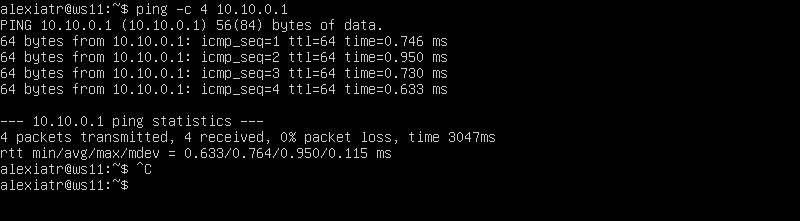
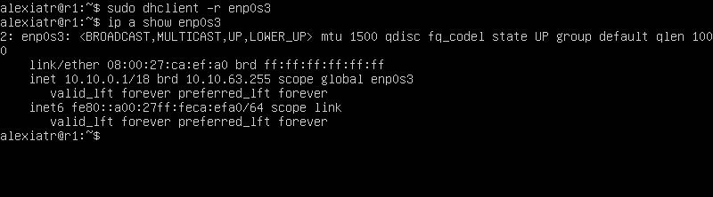
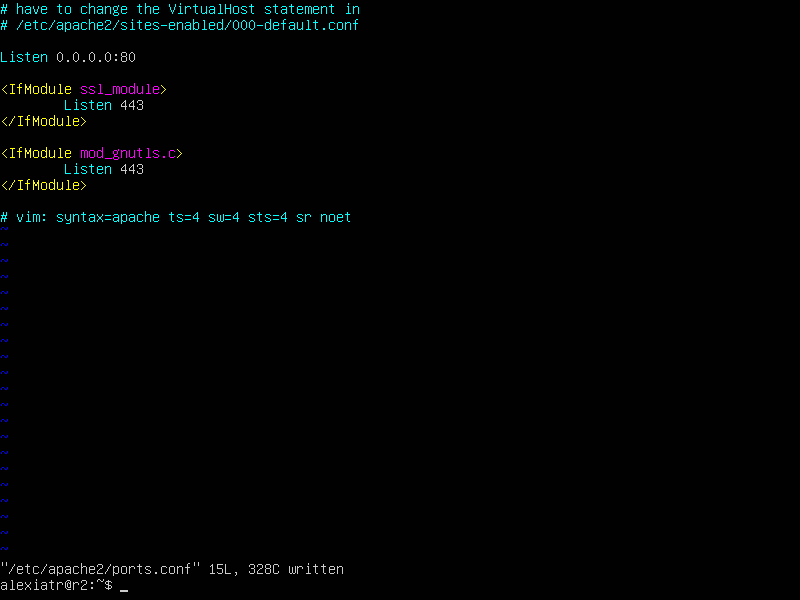

## LINUX NETWORK

- Kerakli vositalarni o'rnatib olish `ipcalc`<br>
`sudo apt install ipcalc`

**1-qism. ipcalc vositasi**
- Tarmoqlar va maskalar
1. Tarmoq manzilini aniqlash:
192.167.38.54/13 manzilini ipcalc bilan aniqlash uchun quyidagi buyruqni kiritdim. <br>

<br>

2. Niqobni prefiks va ikkilik shaklga aylantirish:

Niqob 255.255.255.0 ning prefiks va ikkilik ko'rinishini aniqladim. <br>

 - 255.255.255.0 ni prefiksga va ikkilik shaklga aylantirish: <br>
`ipcalc 0.0.0.0/24` <br>
 - 15 prefiksning oddiy va ikkilik shaklini ko'rish. <br>
`ipcalc 0.0.0.0/15` <br>
 - Ikkilik shaklni prefiks va normal shaklga aylantirish uchun. <br>
`ipcalc 0.0.0.0/20` <br>

<br>

`ipcalc 255.255.255.0`

<br>

3. Maskali 12.167.38.4 tarmog'idagi minimal va maksimal xost: /8 , 11111111.11111111.00000000.00000000 , 255.255.254.0 va /4

- Minimal va Maximal hostlar ko'rsatilgan 

<br>

1. 2. localhos
- 194.34.23.100 - Yo'q. Ochiq IP manzil, localhost bilan bog'liq emas. <br>
- 127.0.0.2 - Ha. Localhost subnetida, kompyuterga mahalliy ilovalar orqali kirish mumkin. <BR>
- 127.1.0.1 - Ha. Localhost subnetida, kompyuterga mahalliy ilovalar orqali kirish mumkin. <br>
- 128.0.0.1 - Yo'q. Ochiq IP manzil, localhost bilan bog'liq emas.<br>


1. 3. Tarmoq diapazonlari va segmentlari 

1) Ochiq va shaxsiy IP manzillarni aniqlash <br>

| IP Manzil       | Holati   | Izoh                                                                       |
|------------------|----------|---------------------------------------------------------------------------|
| 10.0.0.45        | Shaxsiy  | 10.x.x.x diapazonida joylashgan, shaxsiy IP manzil.                     |
| 134.43.0.2       | Ochiq    | Ochiq IP manzil, internetga ulanish uchun mo'ljallangan.                 |
| 192.168.4.4      | Shaxsiy  | 192.168.x.x diapazonida joylashgan, shaxsiy IP manzil.                  |
| 172.0.2.1        | Ochiq    | Ochiq IP manzil, 172.16.0.0 - 172.31.255.255 diapazoniga kirmaydi.      |
| 192.176.2.2      | Ochiq    | Ochiq IP manzil, 192.168.0.0 - 192.168.255.255 diapazoniga kirmaydi.     |
| 10.10.10.10      | Shaxsiy  | 10.x.x.x diapazonida joylashgan, shaxsiy IP manzil.                     |
| 192.169.168.1    | Ochiq    | Ochiq IP manzil, 192.168.0.0 - 192.168.255.255 diapazoniga kirmaydi.     | 

IP manzillarni ushbu saytdan `https://ipinfo.io/` izladim va boshqa manbalardan ham foydalandim. 

2) 10.10.0.0/18 tarmog'i uchun IP manzillarini aniqlash

| IP Manzil       | Holati   |
|------------------|----------|
| 10.0.0.1         | Yo'q     |
| 10.10.0.2       | Mavjud   |
| 10.10.10.10      | Mavjud   |
| 10.10.100.1      | Yo'q     |
| 10.10.1.255      | Mavjud   |


## Part 2. Ikki mashina o'rtasida statik marshrutlash.
- Ikkita virtual mashinani ishga tushirdim. <br>
`ip a (ws1, ws2)`<br>
<br>
<br>

- Ikkala mashinada ham ichki tarmoqqa mos keladigan tarmoq interfeysini tavsiflangan va quyidagi manzillar va maskalarni o'rnatilgan ws1 - 192.168.100.10, maska ​​/16, ws2 - 172.24.116.8, maska ​​/12 <br>


<br>

<br>

`netplan apply`<br>

<br>
<br>

2. 1. Statik marshrutni qo'lda qo'shish

- ```Statik marshrutni qo'shish uchun buyruqlar, ping```<br>

<br>
<br>

2. 2. Statik marshrut qo'shish Saqlash

- ```O'zgartirilgan fayllar etc/netplan/00-installer-config.yaml```<br>

<br>

<br>
- Yana pinglandi.
<br>

<br>

**Part 3. Utilita iperf3**

3. 1. Ulanish tezligi

- 8 Mbps = 1 MB/s<br>
- 100 MB/s = 819200 Kbps<br>
- 1 Gbps = 1024 Mbps<br>

`sudo apt instal iperf3` yuklab olindi. <br>

<br>
<br>

3. 2. Utilita iperf3

- ```O'rtasidagi ulanish tezligi ws1 и ws2```<br>
<br>
<br>

**Part 4. Xavfsizlik devori**

4. 1. Utilita iptables

- ```Qoidalar /etc/firewall.sh```<br>

<br>
<br>

- ```Ikkala mashinada ham fayllarni ishga tushirish```<br>
<br>
<br>

- Agar avval taqiqlovchi qoida bo'lsa, u keyingi ruxsat beruvchi qoidadan ustun bo'ladi.

4. 2. Utilita nmap
 - ```Ping + nmap```<br>
<br>

<br>


## 5-qism: Statik tarmoq marshrutlash

- 5. 1. Mashina manzillarini sozlash

1. Virtual mashinalaringizni ishga tushirildi: 3 ish stantsiyasi (ws11, ws21, ws22) va 2 router (r1, r2). <br>

2. Mashina konfiguratsiyasini sozlang:
/etc/netplan/00-installer-config.yaml faylini tahrirlandi. <br>

- ws11 <br>
<br>

- r1 <br>
<br>

- ws21 <br>
<br>

- ws22 <br>
<br>

- r2 <br>
<br>

3. Tarmoq xizmatini qayta ishga tushirildi. <br>

- ws11 <br>
<br>

- r1 <br>
<br>

- ws21 <br>
<br>

- ws22 <br>
<br>

- r2 <br>
<br>


4. Ping tstlari 

- ws22 dan ws21 ga ping qilindi: <br>
<br>

- r1 dan ws11 ga ham: <br>
<br>

**5. 2. IP yo'naltirishni yoqish**

`sudo sysctl -w net.ipv4.ip_forward=1` <br>
<br>

<br>

- /etc/sysctl.conf Faylini Tahrirlash <br>

<br>
<br>
<br>


**5.3. Birlamchi Marshrutni Konfiguratsiya Qilish**


1. Ish stantsiyalari uchun standart marshrutni (shlyuzni) sozlash: <br>

`/etc/netplan/00-installer-config.yaml`

- ws11 <br>
<br>

- ws21 <br>
<br>

- ws22 <br>
<br>

 -  Natijada marshrutlar ro'yxati ko'rinishi kerak <br>

<br>
<br>
<br>


- ws11 dan r2 ga ping qilindi: <br> 
<br>
<br>


**5.4. Statik marshrutlarni qo'shish**

R1 va R2 routerlariga statik marshrutlarni qo'shishingiz kerak. Masalan, R1 uchun 10.20.0.0/26 tarmog'iga statik marshrut qo'shish quyidagicha bo'ladi
- netplan <br>

<br>
<br>


- Statik marshrutlarning kiritilganligini tekshirish uchun, R1 va R2 routerlarida quyidagi buyruqni bajaring: <br>
Bu yerda siz statik marshrutlarni ko'rishingiz kerak. Masalan, R1 uchun marshrut jadvali quyidagicha ko'rinishi mumkin: <br>

<br>
<br>

`ip r list 10.10.0.0/[netmask]` <br>
`ip r list 0.0.0.0/0` <br>

<br>


- 0.0.0.0/0 marshrut — bu standart marshrut bo'lib, barcha noma'lum yo'nalishlar uchun ishlatiladi. <br>
 - 10.10.0.0/[netmask] marshrut — bu ma'lum bir tarmoq uchun ishlatiladigan marshrut. Agar manzil ma'lum bir tarmoqqa tegishli bo'lsa, tizim ushbu marshrutdan foydalanadi. <br>

 - Bu marshrut aniqroq (spesifik) bo'lganligi sababli, tizim avval ushbu marshrutdan foydalanadi. Standart marshrut esa (0.0.0.0/0) faqat hech qanday boshqa mos marshrut topilmaganda ishlatiladi. <br>
**5.5 Router ro'yxatini tuzish**
 - R1-da tcpdump ishga tushiring<br>
 - ws dan ws21 ga traceroute buyrug'i<br>
 `traceroute 10.20.0.10` <br>
 <br>
  <br>


 **Traceroute yordam dasturi** ICMP so'rovining o'rniga maqsadli xostning ma'lum bir portiga 3 ta UDP paket yuboradi va ushbu portning mavjud emasligi haqida javobni kutadi. Birinchi paket TTL=1 bilan yuboriladi, ikkinchisi TTL=2 bilan va shu tarzda davom etadi, to so'rov manzilga yetib borguncha. ICMP so'rovi o'rniga UDP so'rovi yuborilgani sababli, har bir so'rovda jo'natuvchi va qabul qiluvchining portlari mavjud bo'ladi. Standart bo'yicha, so'rov 34434 yopiq portga yuboriladi. So'rov maqsadli xostga yetib borganida, bu xost «Destination port unreachable» (manzil porti mavjud emas) xabarini jo'natadi. Bu esa so'rov qabul qiluvchi tomonidan olinganini bildiradi. Traceroute ushbu javobni kuzatuv jarayonining tugaganligini bildiruvchi sifatida qabul qiladi.<br>

**5.6. Marshrutlashda ICMP protokolidan foydalanish**

 Birinchi navbatda, R1 marshrutizatorida tcpdump yordamida ICMP trafigini yozib olindi.. Bu bizga ping buyruqining chiqishini kuzatishga imkon beradi. <br>

 - Ping va tcpdump natijalari: <br>
  <br>
  <br>


 **6-qism. DHCP yordamida dinamik IP konfiguratsiyasi**

 - /etc/dhcp/dhcpd.conf: <br>
  <br>
- /etc/resolv.conf filini tahrirlash. resolv.conf faylida DNS-server sifatida 8.8.8.8 ko'rsatildi. Bu DNS-server Google'ga tegishli bo'lib, keng tarqalgan global DNS-server hisoblanadi. <br>
   <br>
 - DHCP xizmatini qayta ishga tushirish uchun quyidagi buyruqni ishlatish: <br>
   <br>

- Ws21-ni qayta yuklash va terminalda ip a ni tekshirish <br>
   <br>
- ws22 dan 21 ga ping yuborish <br>
   <br>

- ws11 uchun MAC manzili qo'shilgan `/etc/netplan/00-installer-config.yaml` faylining mazmuni: <br>
   <br>

- R1 uchun MAC manziliga mustahkam bog'langan shunga o'xshash sozlama<br>
- `/etc/dhcp/dhcpd.conf`<br>
   <br>
   - DNS:<br>
      <br>

   - ws21: <br>
      <br>

- Ushbu buyruqlar `dhclient` yordamida tarmoq interfeysini boshqarish uchun ishlatiladi. <br>
      <br>


**7-qism. NAT**

- Apache2 Serverini Konfiguratsiya Qilish<br>
1. Fayl ochilgandan so'ng, Listen 80 qatorini Listen 0.0.0.0:80 ga o'zgartirildi<br>
      <br>
      <br>

- Apache Veb-Serverini Ishga Tushirish
      <br>
      <br>

      - r2-da Xavfsizlik Devori Qoidalarini O'rnatish
      [Alt text](./rasmlar/84.png "Optional Title")<br>
[Alt text](./rasmlar/85.png "Optional Title")<br>


- ping yuborish <br>
      <br>
      <br>

      - ICMP Protokoli Paketlarini Marshrutlashga Ruxsat Berish, SNAT va DNAT Qo'shish<br>

      <br>

- TCP Ulanishlarini Tekshirish <br>
1. ws22 dan r1 ga SNAT orqali TCP ulanishini tekshirish: <br>
      <br>

2. r1 dan ws22 ga DNAT orqali TCP ulanishini tekshirish: <br>
      <br>
**8-qism. SSH tunnellariga kirish**
- Apapche veb-serverini ws22-da faqat localhost-da ishga tushiring (ya'ni /etc/apache2/ports.conf faylida qatorni Listen 80ga o'zgartirildi Listen localhost:80)<br>
      <br>
- ws21-dan ws22-da veb-serverga kirish uchun ws21-dan ws22-ga mahalliy TCP yo'nalishidan foydalanildi <br>
      <br>
      - telnet 127.0.0.1 [local port]
            <br>

